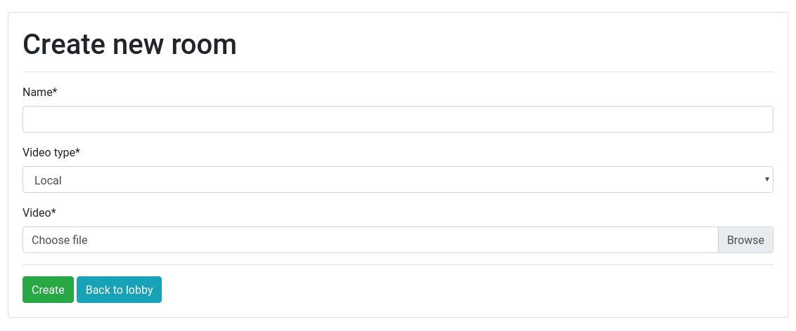
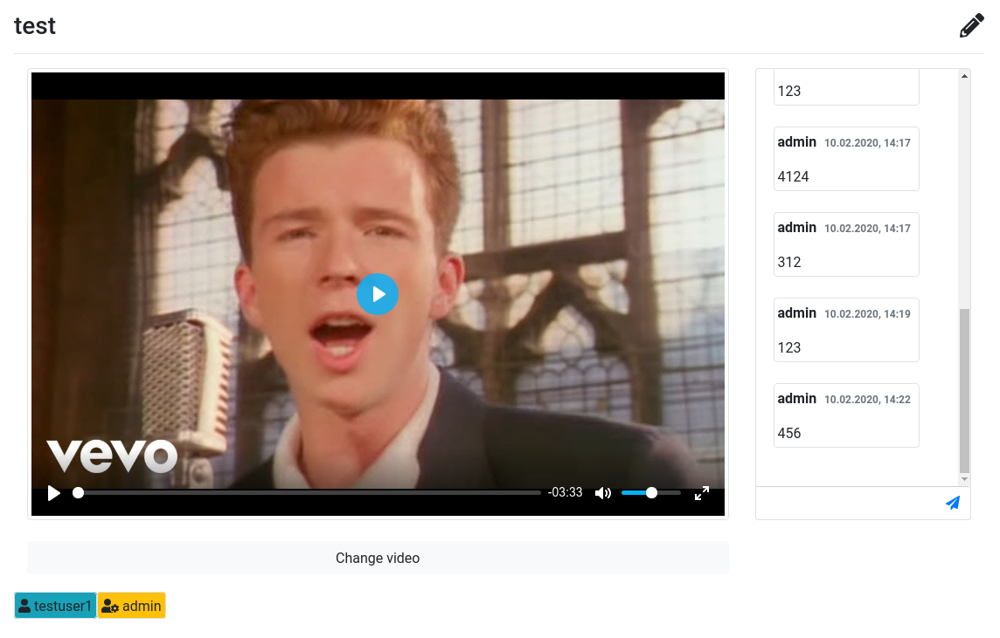

# Watch with friends

1) Use YouTube link or upload a video from your hard drive.

2) Share the link or the name of the room with your friends.

3) When a user plays/pauses a video or seeks to a point, 
his actions will be propagated to all others in the room.
Creator of the room is also able to change a video.

